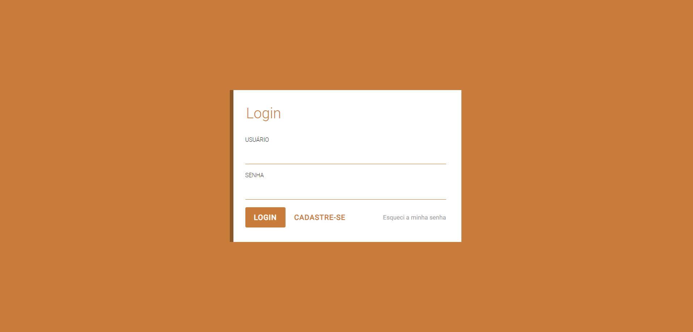
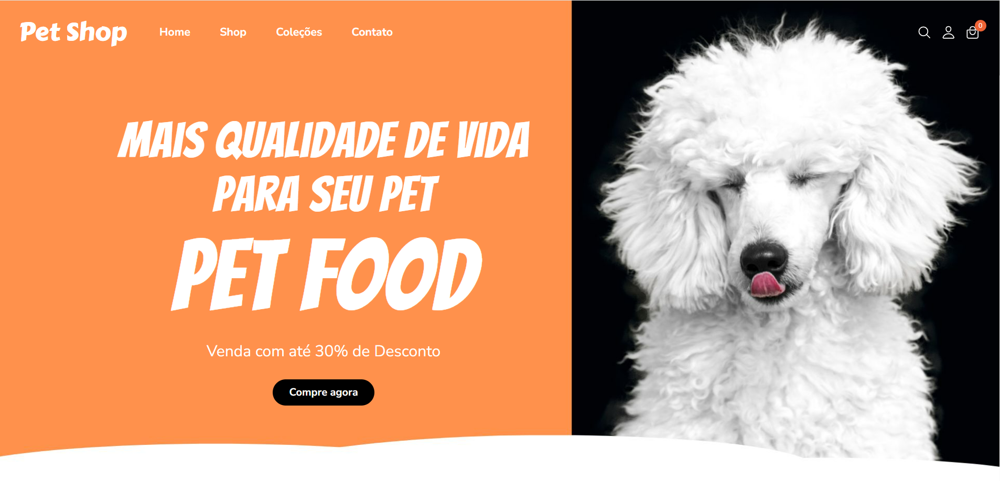
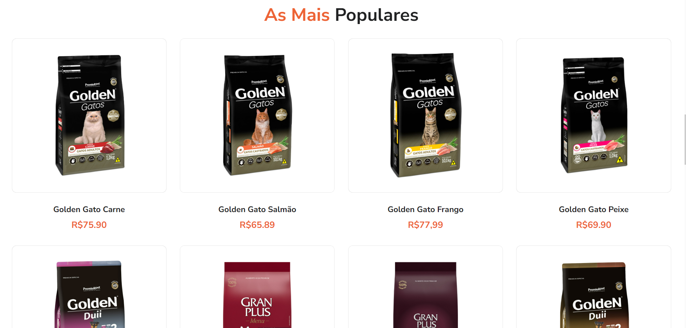

# PetCharme

O projeto PetCharme foi desenvolvido para a disciplina de Autoria Web como projeto final do bimestre do ano 3, do curso de informática.

## Descrição

Este WebSite foi criado para fins acadêmicos, sendo o front-end de um PetShop completo, com tela de login, aba de produtos e área de usuário.

## Capturas de Tela

Tela de login.

Tela inicial.

Aba de produtos.
